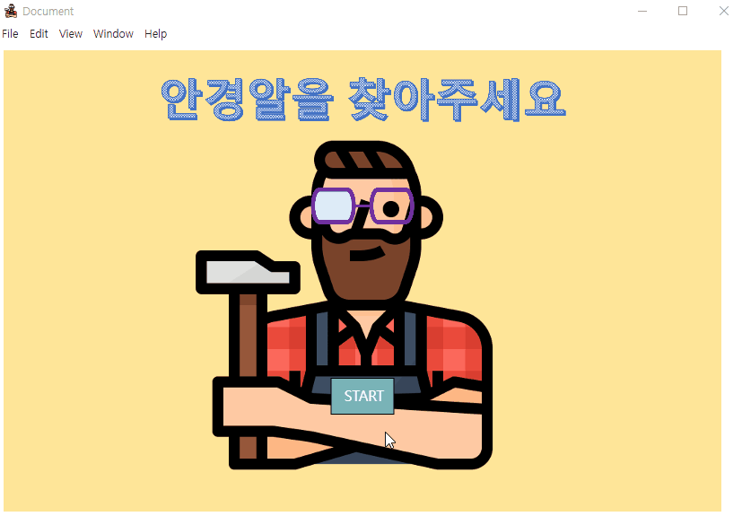

# Finding Game

## 게임 소개

- 본 게임은 잃어버린 안경알을 찾는 게임입니다.
- [Github.io](https://by1994.github.io/Lens-Finding-Game/) 에서 플레이 가능합니다. 혹은 아래의 빌드 방법을 이용하여 window 용 혹은 mac 용으로 빌드하여 플레이 가능합니다.
- [개발 로그](https://computer-choco.tistory.com/474)





## 빌드 정보 (Electron.js)

1. node.js 설치 및 환경 변수 설정

https://nodejs.org/en/


2. electon 및 electron-builder 설치

```shell
npm install electron -g
npm install electron-builder -g
```

설치된 electron 버전 확인을 cmd 창에 아래와 같이 진행한다.

```shell
> electron --version
v15.3.0
```


3. package.json 작성

위에서 설치한 electron 버전 명시가 필요하다. 아니면 빌드시 `none of the possible electron modules are installed ` 에러가 발생한다.

npm init을 하는 경우 package.json 파일을 자동 생성되며, 혹은 직접 만들어도 된다.

```json
{
    "name": "finding-game",
    "version": "1.0.0",
    "description": "Hidden Pictures Game",
    "main": "main.js",
    "author": "BY1994",
    "icon": "assets/icon.ico",
    "devDependencies": {
        "electron": "15.3.0"
    },
    "build": {
        "win": {
          "icon": "assets/icon.ico"
        },
        "mac": {
            "target": ["default"],
            "icon": "assets/icon.icns"
        },
        "dmg": {
            "title": "FindingGame",
            "icon": "assets/icon.icns"
        }
    }
}
```


4. main.js 작성

```js
const { app, BrowserWindow } = require('electron');

function createWindow () {  // 브라우저 창을 생성
  let win = new BrowserWindow({
    width: 850,
    height: 600,
    webPreferences: {
      nodeIntegration: true
    }
  })

  //브라우저창이 읽어 올 파일 위치
  win.loadFile('./index.html')
}

app.on('ready', createWindow);
```


5. 프로젝트 폴더 내에서 빌드 명령어 입력

```shell
electron-builder
```

뒤에 옵션을 붙이지 않으면 디폴트로 window exe 파일이 빌드되었다.

mac os 용이 필요한 경우 `electrong builder build -m` 을 하면 되는데, 윈도우에서는 빌드할 수 없다는 에러 메세지가 뜬다.


## 저작권 정보

1. 배경 음악

   - 음원제공 - BGM팩토리 ([https://bgmfactory.com](https://bgmfactory.com/))

     사용음원 - 봄 사랑

     

2. 메인 페이지 목수 캐릭터
   - [flaticon carpenter](https://www.flaticon.com/free-icon/carpenter_1995595?term=carpenter&related_id=1995595)


3. 게임 배경에 사용된 isometric 이미지 출처

   - [freepik modern-woodworking-machinery-isometric-set](https://www.freepik.com/free-vector/modern-woodworking-machinery-isometric-set_4358888.htm#page=1&position=2&from_view=detail#query=machine%20isometric&position=2&from_view=detail#position=2)

   - [freepik industrial-machinery-flowchart-with-bending-machine-symbols-isometric](https://www.freepik.com/free-vector/industrial-machinery-flowchart-with-bending-machine-symbols-isometric_6839982.htm#page=1&position=5&from_view=detail#&position=5&from_view=detail)
   - [freepik furniture-production-isometric-colored-flowchart-with-design-assembly](https://www.freepik.com/free-vector/furniture-production-isometric-colored-flowchart-with-design-assembly_16608143.htm#page=1&position=5&from_view=detail#&position=5&from_view=detail)

   - [vecteezy meeting-room-isometric-composition](https://www.vecteezy.com/vector-art/1266011-meeting-room-isometric-composition)

   - [vecteezy constructions-tools-drill-hammer-paintbrush-measuring-builders-equipment-isometric-illustration-hammer-screwdriver-drill-equipment](https://www.vecteezy.com/vector-art/3728771-constructions-tools-drill-hammer-paintbrush-measuring-builders-equipment-isometric-illustration-hammer-screwdriver-drill-equipment)